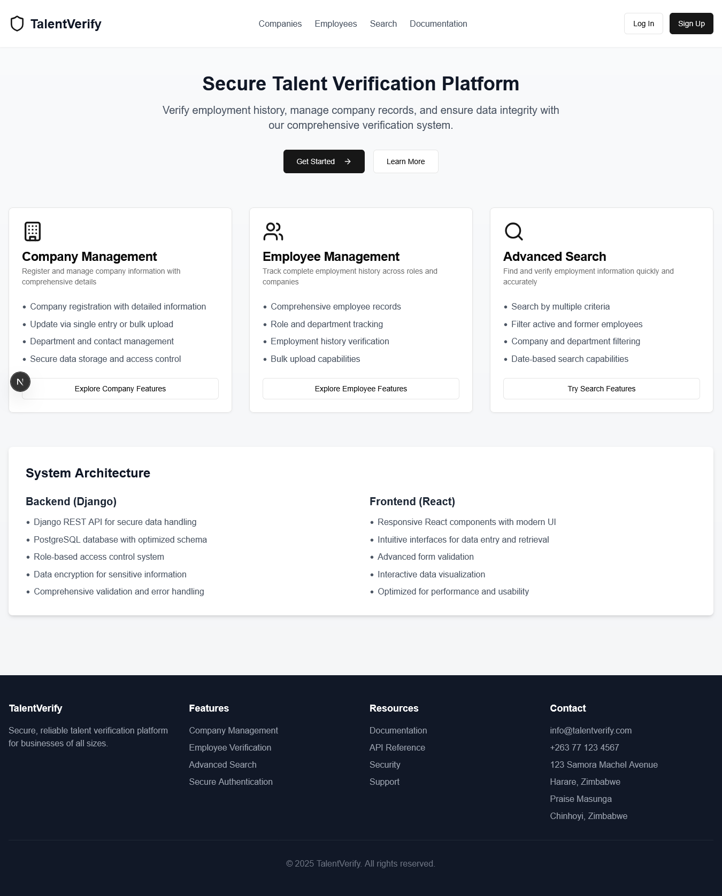
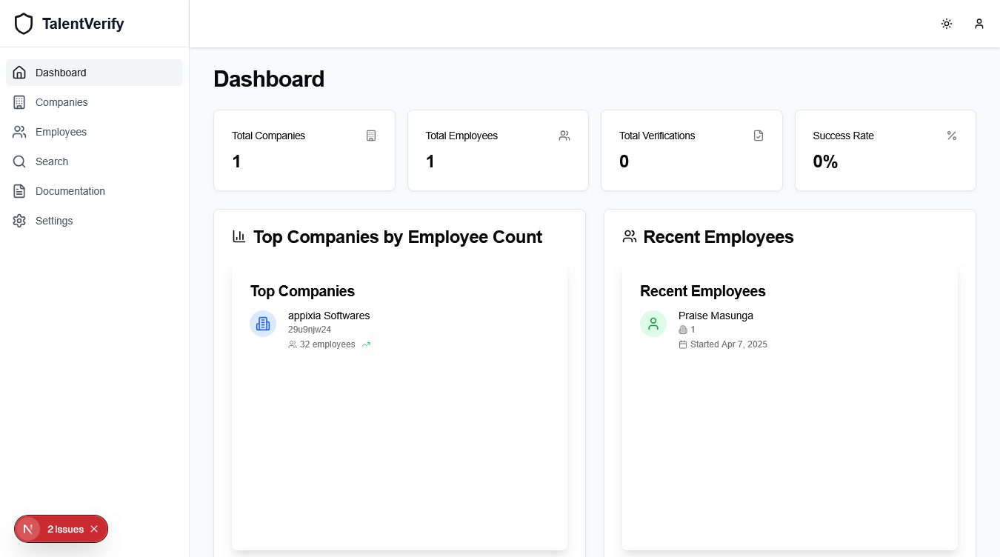

# 🎯 Talent Verification System

<div align="center">

[](https://nextjs.org/)
[](https://www.typescriptlang.org/)
[](https://tailwindcss.com/)
[](https://reactjs.org/)
[](LICENSE)

A modern, secure, and efficient platform for verifying employment records and managing talent data.

[Features](#features) • [Tech Stack](#tech-stack) • [Getting Started](#getting-started)

</div>

## 📸 Preview

<div align="center">
  
  <p><em>Modern and intuitive landing page interface</em></p>
  
  
  <p><em>Comprehensive dashboard with real-time metrics</em></p>
</div>

## ✨ Features

<div align="center">

| 🔐 Authentication | 📊 Dashboard | 🔍 Search | 👥 Management |
|------------------|-------------|-----------|--------------|
| JWT Authentication | Real-time Metrics | Multi-criteria Search | Employee Profiles |
| Protected Routes | Performance KPIs | Advanced Filters | Company Management |
| Role-based Access | Activity Tracking | Date Range Filter | Document Handling |

</div>

### 🔐 Authentication & Security
- 🔑 Secure login system with JWT authentication
- 🛡️ Protected routes and API endpoints
- 👥 Role-based access control
- 🔄 Session management with refresh tokens

### 📊 Dashboard
- 📈 Real-time metrics and analytics
- 🎯 Key performance indicators
- 📝 Recent activities tracking
- 🏢 Top companies overview
- 👥 Employee statistics

### 🔍 Advanced Search
- 🔎 Multi-criteria search functionality
- 🏢 Filter by company, department, and position
- 📅 Date range filtering
- 👤 Employment status filtering
- 📥 Export results to CSV

### 👥 Employee Management
- 👤 Comprehensive employee profiles
- 📋 Employment history tracking
- ✅ Status verification
- 📄 Document management

### 🏢 Company Management
- 🏢 Company profiles and details
- 👥 Employee count tracking
- 🔢 Registration number verification
- 🏢 Department management

## 🛠️ Tech Stack

<div align="center">

| Frontend | Backend | Styling | Tools |
|----------|---------|---------|-------|
| Next.js 15.2.4 | TypeScript | Tailwind CSS 3.4.17 | Git |
| React 19 | JWT Auth | Shadcn/ui | pnpm |
| TypeScript 5 | REST API | Radix UI | VS Code |

</div>

### Core Technologies
- **Framework:** Next.js 15.2.4 with App Router
- **Language:** TypeScript 5
- **UI Library:** React 19
- **Styling:** Tailwind CSS 3.4.17
- **Package Manager:** pnpm

### UI Components & Libraries
- **Component Library:** Shadcn/ui
- **Primitive Components:** Radix UI
- **Icons:** Lucide React
- **Charts:** Recharts
- **Forms:** React Hook Form with Zod validation
- **Date Handling:** date-fns
- **Date Picker:** react-day-picker
- **File Upload:** react-dropzone
- **Animations:** tailwindcss-animate
- **Theming:** next-themes
- **Toast Notifications:** sonner

## 📁 Project Structure

```
talent-verification/
├── app/                    # Next.js app directory
│   ├── (auth)/            # Authentication routes
│   ├── (dashboard)/       # Dashboard routes
│   └── api/               # API routes
├── components/            # React components
│   ├── ui/               # Reusable UI components
│   ├── forms/            # Form components
│   └── dashboard/        # Dashboard-specific components
├── lib/                   # Utility functions and API clients
│   ├── api.ts           # API client functions
│   └── utils.ts         # Utility functions
├── hooks/                # Custom React hooks
├── styles/               # Global styles
├── public/              # Static assets
│   └── screenshots/     # Application screenshots
├── types/               # TypeScript type definitions
└── backend/             # Backend API implementation
```

## 🚀 Getting Started

### Prerequisites

- ⚡ Node.js 18.x or later
- 📦 pnpm (recommended) or npm
- 🔧 Git

### Installation

1. **Clone the repository:**
```bash
git clone https://github.com/yourusername/talent-verification.git
cd talent-verification
```

2. **Install dependencies:**
```bash
pnpm install
```

3. **Set up environment variables:**
```bash
cp .env.example .env.local
```
Edit `.env.local` with your configuration values.

4. **Run the development server:**
```bash
pnpm dev
```

5. **Open [http://localhost:3000](http://localhost:3000) in your browser.**

## 🔌 API Endpoints

### Authentication
| Method | Endpoint | Description |
|--------|----------|-------------|
| POST | `/api/auth/login` | User login |
| POST | `/api/auth/logout` | User logout |
| POST | `/api/auth/refresh` | Refresh access token |

### Companies
| Method | Endpoint | Description |
|--------|----------|-------------|
| GET | `/api/companies` | List all companies |
| GET | `/api/companies/:id` | Get company details |
| POST | `/api/companies` | Create new company |
| PUT | `/api/companies/:id` | Update company |
| DELETE | `/api/companies/:id` | Delete company |

### Employees
| Method | Endpoint | Description |
|--------|----------|-------------|
| GET | `/api/employees` | List all employees |
| GET | `/api/employees/:id` | Get employee details |
| POST | `/api/employees` | Create new employee |
| PUT | `/api/employees/:id` | Update employee |
| DELETE | `/api/employees/:id` | Delete employee |

### Search
| Method | Endpoint | Description |
|--------|----------|-------------|
| GET | `/api/search` | Search employees |
| GET | `/api/search/export` | Export search results |

## 🤝 Contributing

1. 🍴 Fork the repository
2. 🌿 Create your feature branch (`git checkout -b feature/amazing-feature`)
3. 💾 Commit your changes (`git commit -m 'Add some amazing feature'`)
4. 📤 Push to the branch (`git push origin feature/amazing-feature`)
5. 🔄 Open a Pull Request

## 📄 License

This project is licensed under the MIT License - see the [LICENSE](LICENSE) file for details.

## 🙏 Acknowledgments

<div align="center">

| Framework | UI Components | Styling | Tools |
|-----------|---------------|---------|-------|
| [Next.js](https://nextjs.org/) | [Shadcn/ui](https://ui.shadcn.com/) | [Tailwind CSS](https://tailwindcss.com/) | [pnpm](https://pnpm.io/) |
| [React](https://reactjs.org/) | [Radix UI](https://www.radix-ui.com/) | [Lucide Icons](https://lucide.dev/) | [TypeScript](https://www.typescriptlang.org/) |

</div>

---

<div align="center">
  
Made with ❤️ by Praise Masunga

</div>
